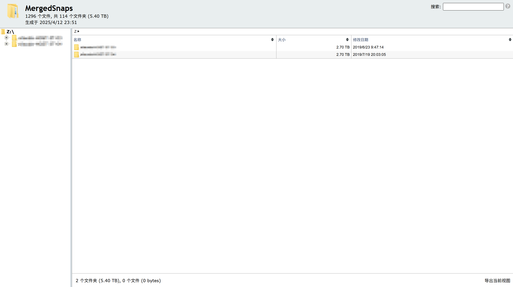

# Snap2HTMLMerger
将Snap2HTML生成的若干HTML合并为一.

Merge multiple HTML files generated by [Snap2HTML](https://github.com/rlv-dan/Snap2HTML) into a single file.

## 用法 Usage
将所有由 [Snap2HTML](https://github.com/rlv-dan/Snap2HTML) 生成的HTML文件拖入`run.bat`

Drag and drop all HTML files generated by [Snap2HTML](https://github.com/rlv-dan/Snap2HTML) into `run.bat`.

你也可以直接用命令行:

You can also use the command line directly:

```
Usage: Snap2HTMLMerger template.html file1.html [file2.html ...]
```

## 效果 Results

